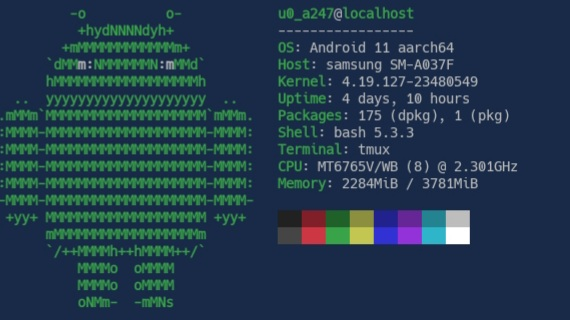
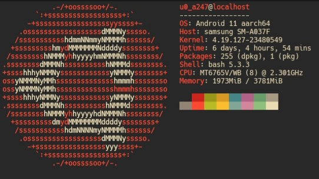
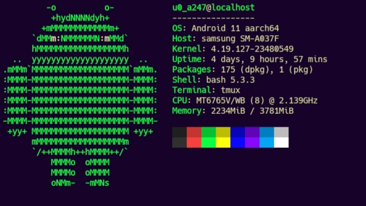
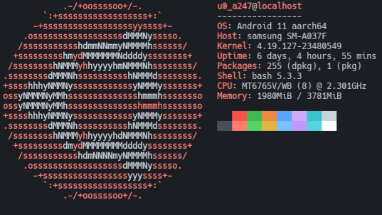
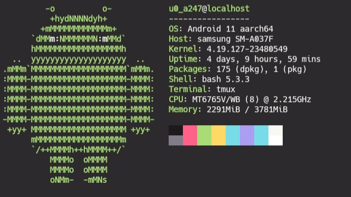
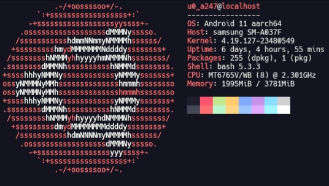

# Dermstyle
Dermstyle is a repository that allows you to customize the color theme in the Termux terminal, such as changing the background color, text, and more. I've provided several custom color themes in this repository.

Before customizing the color theme, be sure to check if there is a folder named ".termux" in your home directory by using a basic command like this.

```$ ls -la ~/.termux```

If there is no ".termux" folder in the home directory, please create it by doing the following:

```$ mkdir ~/.termux```

# Available Themes
Following are the custom color themes available

<details>
  <summary>Bluezard</summary>
  
  
  - colors.properties is available at [Bluezard/colors.properties](./Theme_Colors/Bluezard/colors.properties)
</details>

<details>
  <summary>Gruvbox</summary>

  
  - colors.properties is available at [Gruvbox/colors.properties](./Theme_Colors/Gruvbox/colors.properties)
</details>

<details>
  <summary>Kiyodark</summary>

  
  - colors.properties is available at [Kiyodark/colors.properties](./Theme_Colors/Kiyodark/colors.properties)
</details>

<details>
  <summary>LuminaCode</summary>

  
  - colors.properties is available at [LuminaCode/colors.properties](./Theme_Colors/LuminaCode/colors.properties)
</details>

<details>
  <summary>Mononkai</summary>
  
  
  - colors.properties is available at [Monokai/colors.properties](./Theme_Colors/Monokai/colors.properties)
</details>

<details>
  <summary>Twilight</summary>

  
  - colors.properties is available at [Twilight/colors.properties](./Theme_Colors/Twilight/colors.properties)
</details>


# How to use?
How to use it is very easy, for example if you want to use the Monokai color theme, you only need to move or copy the "colors.properties" file to the home directory ".termux"

Example:

```$ cp ~/Dermstyle/Theme_Colors/Monokai/colors.properties ~/.termux/```

After moving or copying the "colors.properties" file, please restart the Termux application.

# How to set default color theme?
Setting the default color theme is easy; simply delete the "colors.properties" file. Here's how to remove a custom color theme.

```$ rm -rf ~/.termux/colors.properties```

After remove the "colors.properties" file, please restart the Termux application.
